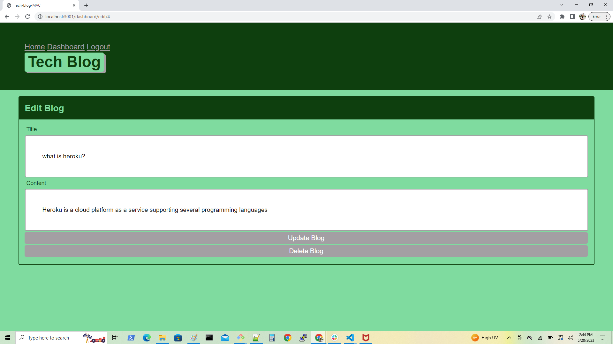

## Tech-blog-MVC

## Description:-

1. Tech-blog-MVC is a CMS-style blog site similar to a Wordpress site.

2. Tech-blog-MVC is where, developers can publish their blog posts and comment on other developers’ posts as well. 

3. Developers can also delete and update their blogs or posts if they are login.

4. Developers can also singup if they want to login andthey are not registered. They can first signup and then login themself.

## Table of Contents

 *  [Installation](#installation)
 *  [URLs](#URLs)
 *  [Assets](#Assets)
 *  [Testing](#testing)

## Steps followed:-

1. First created the "New Repository" i.e "Tech-blog-MVC" in GitHub.

2. In GitBash  navigate to the repository and  to clone "Tech-blog-MVC" repository. Using "cd" command.

3. Then used "git clone <ssh key>" of "Tech-blog-MVC" and clone the repository.

4. Then  created Routes, views, javascript, models, server.js, gitignore, package.json, database file i.e schema.sql, seeds, and README files using touch command.

5. Run "code ." command to open VS.

6.  Executed the code by installing npm install command.

7. Write the code and run by using npm start command.

8.  Created  database blog_db in schema and also created tables and seeds that tables, SOURCE command is used to run  schema.sql

9. After that, added code to GitHub by using "git add -A" command on Gitbash. 

10. Commit the code and add commit message by using "git commit -m <message>".

11. Pull code by using "git pull origin main".

12. Push the code by using "git push origin main".

13. All the final code push in my "Tech-blog-MVC" repository.

 

## URLs:-
Here, you can find the  "Employee-Tracker":- 

Here, you can find the GitHub URL:-

https://github.com/AnujaLawankar/Tech-blog-MVC

## Installation

1. Install inquirer, please use npm i inquirer@8.2.4.
2. Import mysql package.
3. Import express package

## Testing

1. Stop server by using command "ctrl c"
2. Navigate to db directory and run command "SOURCE schema.sql";
3. Navigate to seeds directory and run "node seeds/seed.js";
4. Now restart server by using command "npm start"

## Assets:-

The following images demonstrates the application's appearance:

1. The landing page is the home page of blogs or posts. Where developer just view the blogs. If they are not login in.

2. Login page where developers can login to post their blogs.

3. If developers are not rigistered then they can singup over here.

4. Dashboard where developer can see their own blogs. Or add new blog if they want.

5. When developer click on one of the blog this will redirect them to open that particular blog. where they can update or delete that blog.

6. If developer is login in then they can comment on any blog as they want.

7. When developer is not login in then they can just open and see the comments of other developers.

## License

 MIT  License  